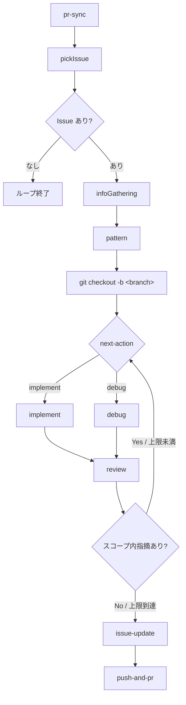

# issue-loop

Claude Code をはじめとするコーディングエージェントで動くプラグイン。Issue（ここでは GitHub の Issue に限らず、プロジェクトの Todo リストとして捉える）ベースに開発を進め、自動的にループして次の Issue に取り組み続ける。

## コンポーネント一覧

### Skills（Claudeへの命令スキル）

- **`/issueloop`**：ループを開始・初期化する。Stop hook と組み合わせてループを制御する
- **`/push-and-pr`**：コミット・プッシュ・PR作成を一括実行する（`commit-commands:commit-push-pr` を流用）
- **`/cancel`**：実行中のループを中断する

### Agents（コンテキストを分離して実行するサブエージェント）

- **`/pr-sync`**：前回チェック時点との差分を取得し、マージ済みPRと新規コメントが付いたPRを検出する。新規コメント付きPRからは Issue を自動作成し、重複防止のためPRにコメントで記録する。結果を `pr-context.md` に書き出す
- **`/pickIssue`**：GitHub から最優先で取り組むべき Issue を1つ選ぶ。依存関係・既存PRの有無・`pr-context.md` のマージ情報を考慮して判断する
- **`/infoGathering`**：Issue の不足情報を `AskUserQuestion` で同期的にユーザーへ質問し、回答をコメントとして Issue に追記する
- **`/pattern`**：Issue のタイプを `Feature` / `Debug` / `Refactor` / `Test` に分類し、結果をファイルに書き出す
- **`/implement`**：実装を行う。`feature-dev:feature-dev` スキルに委譲し、完了後に `pr-review-toolkit:code-simplifier` でコードを整理する。最後にスコープ外の発見事項を書き出す
- **`/debug`**：デバッグを行う。`feature-dev:code-explorer` エージェントを内部で活用する独自実装。最後にスコープ外の発見事項を書き出す
- **`/review`**：複数の専門エージェントを並列実行して変更内容をレビューする。各エージェントの指摘を「スコープ内」と「スコープ外」に分類し、`review-result.md` に書き出す
- **`/issue-update`**：`/implement` や `/debug` が書き出したスコープ外の発見事項を統合・整理したうえで既存 Issue と照合し、重複のない新規 Issue を登録する

## ループのフロー（1イテレーション）



外側のループは Stop hook が制御する。Issue が残っていれば次のイテレーションを開始し、残っていなければ終了する。

## ループ機構

ralph-loop プラグインと同じパターンを採用する。

- `hooks/hooks.json` で Stop hook を定義し、`hooks/stop-hook.sh` がループの継続・終了を制御する
- ループ状態は `.issue-loop.local.md` に YAML frontmatter 形式で保持する

```yaml
---
iteration: 1
max_iterations: 20
max_review_iterations: 3
session_id: <session_id>
---
```

Stop hook の動作：
1. `.issue-loop.local.md` が存在しなければ終了（ループが開始されていない or キャンセル済み）
2. `max_iterations` 超過で終了
3. 続行する場合は `{ "decision": "block", "reason": "<次回ループのプロンプト>" }` を出力

ループ終了条件：
- 取り組む Issue が0件
- `max_iterations` 超過
- ユーザーが `/cancel` を実行

エラー発生時の挙動：エラーの種類によらず、現在の Issue に「自動化失敗: `<理由>`」をコメントして次の Issue へスキップする。

## エージェント間インターフェース

各エージェントはファイルを介してデータを受け渡すことでコンテキストを節約する。ファイルはすべて `.issue-loop/` 以下に置く。

| ファイル | 書き込み | 読み込み | 用途 |
|---|---|---|---|
| `pr-snapshot.json` | /pr-sync | /pr-sync | 前回チェック時刻（`checked_at`）を保持するJSON |
| `pr-context.md` | /pr-sync | /pickIssue | 前回チェックからの差分（マージ済みPR一覧・新規コメント起因のIssue一覧） |
| `current-issue.md` | /pickIssue, /infoGathering, /pattern | /pattern, /implement, /debug | Issue の詳細・収集情報・タイプ |
| `next-action.md` | /pattern, /review | /issueloop | `implement` または `debug` の判定結果 |
| `review-result.md` | /review | /implement, /debug, /issueloop | レビュー結果・指摘内容・推奨アクション・合否 |
| `out-of-scope.md` | /implement, /debug | /issue-update | スコープ外の発見事項リスト |

`current-issue.md` の構造：
```markdown
---
number: 123
title: "Issue title"
type: Feature | Debug | Refactor | Test
---
Issueの本文・追加収集情報
```

`review-result.md` の構造：
```markdown
---
status: pass | fail
next-action: implement | debug
---
## スコープ内の指摘（implement / debug に渡して今回修正する）
- ...

## スコープ外の指摘（Issue 登録対象）
- ...
```

スコープ外の指摘は `out-of-scope.md` にも追記し、`/issue-update` が既存 Issue と照合して登録する。

## /pr-sync の詳細設計

### 目的

前回チェック時点との差分を検出し、以下の2つの情報を後続ステップに渡す。

- **マージ済みPR**: `pickIssue` が依存関係を解消済みと判断するために使う
- **新規コメント付きPR**: フィードバックを Issue 化して次のイテレーションで対応できるようにする

### pr-snapshot.json の構造

```json
{
  "checked_at": "<ISO8601>"
}
```

差分検出はすべて `scripts/pr-sync-gather.sh` がシェルスクリプトで行う。

### 差分検出ロジック（スクリプト内）

- **マージ済みPR**: `gh pr list --state merged` の `mergedAt` を `checked_at` と `jq` で比較
- **新規コメント付きPR**: `gh pr list --state open --json comments` の `createdAt` を `checked_at` と比較し、`[issue-loop]` 始まりのコメントは除外

差分収集後、`checked_at` を現在時刻で更新してスナップショットを上書きする。

### AIが判断する部分

`prs_with_new_comments` に挙がったPRのコメントを `gh pr view --comments` で取得し、修正・改善・バグを示唆するものかを判断してIssueを作成する。

### Issue 自動作成と重複防止

新規コメントが「修正・改善を示唆している」と判断した場合に Issue を作成する。

重複を防ぐため、Issue 作成後に対象PRへ以下の形式でコメントを投稿する:

```
[issue-loop] Issue #<number> を作成しました: <title>
```

スキャン時に既存PRコメントにこの形式が含まれていれば、そのコメントからは Issue を作成しない。

### pr-context.md の構造

```markdown
## マージされたPR
- #42: "Fix auth bug"
- #38: "Add user profile page"

## 新規コメントから作成したIssue
- Issue #55（PR #40 のコメントより）: "エラーメッセージが不親切"
```

## /review の詳細設計

複数の専門エージェントを並列実行し、それぞれの結果を集約する。

### レビューエージェント一覧

| エージェント | 観点 | 流用元 |
|---|---|---|
| comment-reviewer | コメントの妥当性。ファイル冒頭以外では「Why」のみを書く方針に沿っているか | `pr-review-toolkit:comment-analyzer` |
| design-reviewer | 既存設計との整合性・設計の妥当性（将来の肥大化リスク・過剰抽象化がないか） | 独自実装 |
| type-safety-reviewer | TypeScript の `as` 使用箇所の妥当性、lint/型チェッカー抑制コメントの理由が正当か | 独自実装 |
| security-reviewer | セキュリティ上の問題がないか（OWASP Top 10 相当） | 独自実装 |
| test-reviewer | 既存テストへの影響、新しいロジックに対応するテストが存在するか | `pr-review-toolkit:pr-test-analyzer` |
| error-handling-reviewer | 例外の握りつぶし・silent failures がないか | `pr-review-toolkit:silent-failure-hunter` |
| performance-reviewer | 明らかな非効率（N+1 クエリ・不要なループなど）がないか | 独自実装 |

### スコープ内 / スコープ外の分類基準

- **スコープ内**：今回の Issue の変更範囲内で発生している問題。`implement` または `debug` で即座に修正する
- **スコープ外**：今回の変更に関係するが Issue のスコープ外の問題、または変更前から存在していた既存コードの問題。Issue として登録して後回しにする

### pass / fail の判定

いずれかのエージェントがスコープ内の指摘を報告した場合は `fail`。スコープ内の指摘が0件であれば `pass`。

## 権限設計

各コンポーネントの `allowed-tools` フロントマター案。

| コンポーネント | 主要な allowed-tools |
|---|---|
| `/issueloop` | `Bash(bash *setup-issue-loop.sh:*)`, `Bash(git checkout -b:*)`, `Task` |
| `/pr-sync` | `Bash(gh pr list:*)`, `Bash(gh pr view:*)`, `Bash(gh issue create:*)`, `Bash(gh pr comment:*)`, `Read`, `Write` |
| `/pickIssue` | `Bash(gh issue list:*)`, `Bash(gh issue view:*)`, `Bash(gh pr list:*)`, `Read`, `Write` |
| `/infoGathering` | `Bash(gh issue comment:*)`, `Bash(gh issue view:*)`, `Read`, `Write`, `Task` |
| `/pattern` | `Read(.issue-loop/current-issue.md)`, `Write(.issue-loop/next-action.md)` |
| `/review` | `Bash(git diff:*)`, `Read`, `Glob`, `Grep`, `Task`, `Write(.issue-loop/review-result.md)` |
| `/debug` | `Bash`, `Read`, `Grep`, `Glob`, `Task`, `Write(.issue-loop/out-of-scope.md)` |
| `/issue-update` | `Bash(gh issue create:*)`, `Bash(gh issue list:*)`, `Bash(gh issue view:*)`, `Read` |
