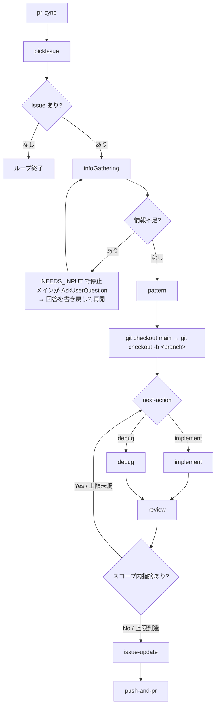

# issue-loop

Claude Code をはじめとするコーディングエージェントで動くプラグイン。Issue（ここでは GitHub の Issue に限らず、プロジェクトの Todo リストとして捉える）ベースに開発を進め、自動的にループして次の Issue に取り組み続ける。

## コンポーネント一覧

### Skills（Claudeへの命令スキル）

- **`/issueloop`**：ループのオーケストレーター。セットアップ・ループ制御・各サブエージェントの呼び出しをすべて担う
- **`/push-and-pr`**：コミット・プッシュ・PR作成を一括実行する（`commit-commands:commit-push-pr` を流用）。フロントエンドの変更があり開発サーバーが起動している場合は、スクリーンショットを撮影して PR コメントに添付する。監視パスとURLは `.claude/issue-loop.local.md` で設定可能
- **`/cancel`**：実行中のループを中断する
- **`/close-issues [N]`**：最新N件のマージ済みPRを対象に、関連するオープンIssueを一括クローズする。番号言及・ブランチ名・タイトル類似で候補ペアを絞り込んでから、各(PR, Issue)ペアの判定を `pr-resolves-issue` エージェントへ委譲して並列起動する

### Agents（コンテキストを分離して実行するサブエージェント）

- **`iteration`**：1イテレーション（PR同期→Issue選定→実装→レビュー→PR作成）全体を担うオーケストレーター。各サブエージェントをネストして呼び出し、終了時に `iteration-signal` へ結果を書き出す
- **`pr-sync`**：前回チェック時点との差分を取得し、マージ済みPRと新規コメントが付いたPRを検出する。新規コメント付きPRからは Issue を自動作成し、重複防止のためPRにコメントで記録する。結果を `pr-context.md` に書き出す
- **`pick-issue`**：GitHub から最優先で取り組むべき Issue を1つ選ぶ。依存関係・既存PRの有無・`pr-context.md` のマージ情報で候補を絞り込み、ユーザー指定基準＞提供価値の高さ（バグ修正＞機能欠落の補完＞UX/品質改善＞cosmetic）＞マイルストーン/番号順で選定する
- **`info-gathering`**：Issue の不足情報を確認する。`AskUserQuestion` はサブエージェントから使えないため自分では質問せず、不足があれば質問内容を `questions.md` に書き出してメインセッションへ委ねる（エスカレーション方式）。再開時は `answers.md` の回答を `current-issue.md` と Issue に取り込んで進める
- **`pattern`**：Issue のタイプを `Feature` / `Debug` / `Refactor` / `Test` に分類し、結果をファイルに書き出す
- **`implement`**：実装を行う。`feature-dev:code-explorer` で調査し、実装後に `pr-review-toolkit:code-simplifier` でコードを整理する。最後にスコープ外の発見事項を書き出す
- **`debug`**：デバッグを行う。`feature-dev:code-explorer` で根本原因を特定し、修正を実装する。最後にスコープ外の発見事項を書き出す
- **`review`**：まず `.issue-loop/ci.sh`（存在する場合）を実行し、失敗なら即 `fail` とする。CI 通過後、必須レビュワー3種を常に、オプショナルレビュワー4種を Issue・変更内容に応じて自律選択して並列実行する。各エージェントの指摘を「スコープ内」と「スコープ外」に分類し、`review-result.md` に書き出す
- **`issue-update`**：`implement` や `debug` が書き出したスコープ外の発見事項を統合・整理したうえで既存 Issue と照合し、重複のない新規 Issue を登録する
- **`pr-resolves-issue`**：PR番号とIssue番号を受け取り、そのPRがIssueを解決しているかを `yes`/`no` で `.issue-loop/close-check/pr<N>-issue<M>.txt` に書き出す。`/close-issues` から各ペアに対して並列で呼ばれる
- **`result-dashboard`**：ループ終了後に自動的に呼ばれ、今回の実行結果を集計・表示する。`gh pr list` で作成PRを取得し、Claude Code の JSONL ログを Python で解析してトークン使用量を集計する

## ループのフロー（1イテレーション）



外側のループは `/issueloop` スキル自身が制御する。

## ループ機構

`/issueloop` スキルがオーケストレーターとして動作し、ループをスキル内のロジックで完結させる。外部 hook には依存しない。

ループ終了条件：
- 取り組む Issue が0件（`NO_ISSUE` シグナル）
- `max_iterations` 超過
- ユーザーが `/cancel` を実行（`.issue-loop/cancel-requested` フラグを検出 → `CANCELLED` シグナル）
- イテレーションが続行不能な失敗で終了（`FAILED` シグナル、またはシグナル未書き込みかつ PR も存在しない）

各イテレーションは終了時に `.issue-loop/iteration-signal` へ `DONE` / `NO_ISSUE` / `CANCELLED` / `NEEDS_INPUT` / `FAILED` のいずれかを書き出す。オーケストレーターはイテレーション起動前に同ファイルを削除し、起動後に内容を読む。シグナルが空（コンテキスト圧縮等でシグナル書き込みが漏れた場合）には即停止せず、PR の存在を確認して DONE 相当と判断できればループを継続する。PR も確認できない場合のみ異常終了としてループを停止する。

### NEEDS_INPUT（ユーザーへの質問）

`AskUserQuestion` はサブエージェントからは使えず、メインセッションの UI でのみ動作する。そのため info-gathering で情報不足を検出した場合、iteration は `questions.md` に質問を書き出し `NEEDS_INPUT` シグナルで停止する（ブランチ作成より前で止めるため Issue 選定状態は保たれる）。オーケストレーターは `questions.md` を読んで `AskUserQuestion` で質問し、回答を `answers.md` に書き戻したうえで iteration を `RESUME=true` で再起動する。再起動時は PR同期・Issue選定をスキップし、info-gathering が回答を取り込んで先へ進む。この再開はイテレーション数にカウントしない。

エラー発生時の挙動：必須ファイルの欠落・PR 作成失敗など続行不能な異常は、リトライやデバッグを繰り返さず `FAILED` を書いてループを停止する。同一 Issue を次イテレーションで無限に選び直す事故を防ぐため、PR が実在することを検証してから `DONE` とする。キャンセル要求は各ステップの区切りで検出し、現在のステップ完了後に停止する。

### 出力契約の保証（Stop フック）

「必ず特定のファイルを書き出して終了する」契約を持つエージェントは、フロントマターの `Stop` フックで自分の出力ファイルの存在を終了時に検証する。ファイルが未作成なら `decision: block` でエージェントに書き出しを促してから終了させる。LLM がステップを完了しながら最終的な書き出しだけを忘れて終了する事故を防ぐ安全網であり、ループ駆動を hook に依存させるものではない。

**既知の制限**: エージェント frontmatter の `Stop` フックは、`Agent` ツールで起動したサブエージェント（sidechain セッション）には適用されないことが確認されている。stop_hook_summary レコードがサブエージェントセッションに記録されず、フック自体が発火しない。このため iteration エージェントの Stop フックは現時点では安全網として機能しておらず、プロンプト指示レベルの明示と、issueloop オーケストレーター側の回復ロジックで補完している。

このフックが確実に機能するのは、対象ファイルが「呼び出し直前に削除され、呼ばれたら必ず書かれる」エージェントに限る（前イテレーションの残骸を存在チェックで誤判定しないため、オーケストレーターは各サブエージェント起動の直前に対象ファイルを削除する）。対象は iteration（`iteration-signal`）・pr-sync（`pr-context.md`）・pick-issue（`current-issue.md`）・pattern（`next-action.md`）・review（`review-result.md`）。条件付き出力や成果物がコード編集のみのエージェント（info-gathering・implement・debug・issue-update）はフック検証の対象外とする。

無限ブロックを避けるため、各フックは `stop_hook_active` が真の場合（一度ブロックして再開された後）は再ブロックせずそのまま終了させる。

## エージェント間インターフェース

各エージェントはファイルを介してデータを受け渡すことでコンテキストを節約する。ファイルはすべて `.issue-loop/` 以下に置く。

| ファイル | 書き込み | 読み込み | 用途 |
|---|---|---|---|
| `pr-snapshot.json` | /pr-sync | /pr-sync | 前回チェック時刻（`checked_at`）を保持するJSON |
| `pr-context.md` | /pr-sync | /pickIssue | 前回チェックからの差分（マージ済みPR一覧・新規コメント起因のIssue一覧） |
| `current-issue.md` | /pickIssue, /infoGathering, /pattern | /pattern, /implement, /debug | Issue の詳細・収集情報・タイプ |
| `issue-selection-comment.md` | /issueloop | /pickIssue | ユーザーが指定した Issue 選定基準。存在しない場合は既定基準で選定 |
| `questions.md` | /infoGathering | /issueloop | 情報不足時にユーザーへ尋ねる質問（`AskUserQuestion` 形式）。存在＝要ユーザー入力 |
| `answers.md` | /issueloop | /infoGathering | ユーザーの回答。再開時に info-gathering が取り込む |
| `next-action.md` | /pattern, /review | /issueloop | `implement` または `debug` の判定結果 |
| `review-result.md` | /review | /implement, /debug, /issueloop | レビュー結果・指摘内容・推奨アクション・合否 |
| `out-of-scope.md` | /implement, /debug, /review | /issue-update | スコープ外の発見事項リスト |
| `iteration-signal` | /iteration | /issueloop | イテレーション結果（`DONE`/`NO_ISSUE`/`CANCELLED`/`NEEDS_INPUT`/`FAILED`）。起動前にオーケストレーターが削除する |
| `cancel-requested` | /cancel | /issueloop, /iteration | キャンセル要求フラグ（存在＝要求あり） |
| `start-time` | setup-issue-loop.sh | /result-dashboard | ループ開始時刻（UTC ISO 8601）。`result-dashboard` がPR/トークン集計の起点として使う |
| `changes.diff` | /review（PreToolUse フック） | 各レビュワー | `git add -A` 済み状態から生成する正準差分。全レビュワーが共通で参照する |
| `ci.sh` | /issueloop（初回セットアップ時） | /review | プロジェクトのビルドシステムから生成した lint / test 実行スクリプト |

`current-issue.md` の構造：
```markdown
---
number: 123
title: "Issue title"
type: Feature | Debug | Refactor | Test
labels: bug enhancement
milestone: v1.0
---
Issueの本文・コメント・追加収集情報
```

本文・コメントは `/pickIssue` が `gh issue view --template` の出力をそのままファイルへ書き出す（LLM に転記させると要約・欠落が起きるため）。`type` は後段の `/pattern` が埋める。

`review-result.md` の構造：
```markdown
---
status: pass | fail
next-action: implement | debug
---
## スコープ内の指摘（implement / debug に渡して今回修正する）
| 重大度 | 場所 | 指摘 |
|---|---|---|

## スコープ外の指摘（Issue 登録対象）
- ...
```

出力量は結果に応じて調整する（認知負荷の削減）。`pass` の場合はスコープ内の表を省いて「なし」とだけ記し全体を短い要約に留め、`fail` の場合のみスコープ内の指摘を重大度の高い順に表で記載する。

スコープ外の指摘は `out-of-scope.md` にも追記し、`/issue-update` が既存 Issue と照合して登録する。

## /pr-sync の詳細設計

### 目的

前回チェック時点との差分を検出し、以下の2つの情報を後続ステップに渡す。

- **マージ済みPR**: `pickIssue` が依存関係を解消済みと判断するために使う
- **新規コメント付きPR**: フィードバックを Issue 化して次のイテレーションで対応できるようにする

### pr-snapshot.json の構造

```json
{
  "checked_at": "<ISO8601>"
}
```

差分検出はすべて `scripts/pr-sync-gather.sh` がシェルスクリプトで行う。

### 差分検出ロジック（スクリプト内）

- **マージ済みPR**: `gh pr list --state merged` の `mergedAt` を `checked_at` と `jq` で比較
- **新規コメント付きPR**: `gh pr list --state open --json comments` の `createdAt` を `checked_at` と比較し、`[issue-loop]` 始まりのコメントは除外

差分収集後、`checked_at` を現在時刻で更新してスナップショットを上書きする。

### AIが判断する部分

`prs_with_new_comments` に挙がったPRのコメントを `gh pr view --comments` で取得し、修正・改善・バグを示唆するものかを判断してIssueを作成する。

### Issue 自動作成と重複防止

新規コメントが「修正・改善を示唆している」と判断した場合に Issue を作成する。

重複を防ぐため、Issue 作成後に対象PRへ以下の形式でコメントを投稿する:

```
[issue-loop] Issue #<number> を作成しました: <title>
```

スキャン時に既存PRコメントにこの形式が含まれていれば、そのコメントからは Issue を作成しない。

### pr-context.md の構造

```markdown
## マージされたPR
- #42: "Fix auth bug"
- #38: "Add user profile page"

## 新規コメントから作成したIssue
- Issue #55（PR #40 のコメントより）: "エラーメッセージが不親切"
```

## /review の詳細設計

まず CI（`.issue-loop/ci.sh`。`/issueloop` がセットアップ時にプロジェクトのビルドシステムから生成する）を実行し、失敗した場合はレビュワーを起動せず即 `fail` を書き出す。CI 通過後、専門エージェントを並列実行し、それぞれの結果を集約する。

### レビューエージェント一覧

必須レビュワーは常に実行する。オプショナルレビュワーは、オーケストレーターが Issue のタイトル・ラベルと変更ファイルの種類から実行要否を判断する。

| エージェント | 区分 | 観点 | 流用元 |
|---|---|---|---|
| type-safety-reviewer | 必須 | TypeScript の `as` 使用箇所の妥当性、lint/型チェッカー抑制コメントの理由が正当か | 独自実装 |
| security-reviewer | 必須 | セキュリティ上の問題がないか（OWASP Top 10 相当） | 独自実装 |
| error-handling-reviewer | 必須 | 例外の握りつぶし・silent failures がないか | `pr-review-toolkit:silent-failure-hunter` |
| comment-reviewer | オプショナル | コメントの妥当性。ファイル冒頭以外では「Why」のみを書く方針に沿っているか | `pr-review-toolkit:comment-analyzer` |
| design-reviewer | オプショナル | 既存設計との整合性・設計の妥当性（将来の肥大化リスク・過剰抽象化がないか） | 独自実装 |
| test-reviewer | オプショナル | 既存テストへの影響、新しいロジックに対応するテストが存在するか | `pr-review-toolkit:pr-test-analyzer` |
| performance-reviewer | オプショナル | 明らかな非効率（N+1 クエリ・不要なループなど）がないか | 独自実装 |

### 共通レビュー契約（関心の分離）

各レビュワーは自身の**観点・重大度の定義**（ドメイン知識）のみを持ち、全レビュワーで共通する**スコープ分類（scope_in / scope_out）と出力フォーマット（`{"scope_in": [...], "scope_out": [...]}` の JSON）**はオーケストレーター（`/review`）が「共通レビュー契約」として一元定義し、各レビュワー起動時の prompt で注入する。Claude Code にはプロンプトの取り込み機構がないため、唯一の注入点であるオーケストレーターに契約を集約することで重複と定義のドリフトを防ぐ。流用元エージェント（pr-review-toolkit 系）にも同じ契約を prompt で適用する。

オーケストレーターの prompt は観点を1行で指定し、チェック項目は列挙しない（各レビュワー本体が保持するため、二重管理を避ける）。

### スコープ内 / スコープ外の分類基準

- **スコープ内**：今回の Issue の変更範囲内で発生している問題。`implement` または `debug` で即座に修正する
- **スコープ外**：今回の変更に関係するが Issue のスコープ外の問題、または変更前から存在していた既存コードの問題。Issue として登録して後回しにする

### pass / fail の判定

いずれかのエージェントがスコープ内の指摘を報告した場合は `fail`。スコープ内の指摘が0件であれば `pass`。

## 権限設計

必要最小限のツールのみを許可する方針を取る。各コンポーネントの許可ツールは、コマンドは `allowed-tools`、エージェントは `tools` のフロントマターを正とする（本ドキュメントには列挙しない。二重管理による乖離を防ぐため）。

利用者がプロジェクト側の `settings.local.json` に設定すべき推奨パーミッションは README に記載する。
