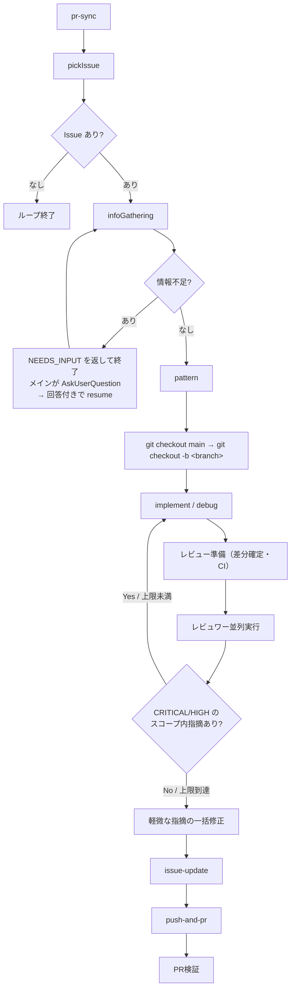

# issue-loop

Claude Code をはじめとするコーディングエージェントで動くプラグイン。Issue（ここでは GitHub の Issue に限らず、プロジェクトの Todo リストとして捉える）ベースに開発を進め、自動的にループして次の Issue に取り組み続ける。

## コンポーネント一覧

### Skills（Claudeへの命令スキル）

- **`/issueloop`**：ループのエントリポイント。セットアップ・ループ制御・ユーザーへの質問代行・キャンセル確認のみを担い、1イテレーションのオーケストレーションは dynamic workflow（`workflows/iteration.js`）へ委譲する
- **`/push-and-pr`**：コミット・プッシュ・PR作成を一括実行する（`commit-commands:commit-push-pr` を流用）。フロントエンドの変更があり開発サーバーが起動している場合は、スクリーンショットを撮影して PR コメントに添付する。監視パスとURLは `.claude/issue-loop.local.md` で設定可能。private リポジトリでは画像URLが認証なしで表示できないためスクリーンショット関連処理はスキップされる
- **`/cancel`**：実行中のループをイテレーションの区切りで中断する（実行中のイテレーション自体の停止は `/workflows` ビューで行う）
- **`/close-issues [N]`**：最新N件のマージ済みPRを対象に、関連するオープンIssueを一括クローズする。番号言及・ブランチ名・タイトル類似で候補ペアを絞り込んでから、各(PR, Issue)ペアの判定を `pr-resolves-issue` エージェントへ委譲して並列起動する
- **`/consolidate-issues`**：オープンIssueから同種の細粒度Issueを洗い出して統合する（統合Issueの新規作成＋元Issueのクローズ）。統合案をユーザーへ提示し、承認されたグループのみ実行する。オープンPRが参照するIssueは自動クローズとトレーサビリティを壊すため対象外。`/issueloop` のループ終了後にも自動で呼ばれる

### Workflows（スクリプトによる決定的オーケストレーション）

- **`iteration.js`**：1イテレーション（PR同期→Issue選定→情報収集→分類→実装/レビュー→PR作成→PR検証）のオーケストレーター。ループ・分岐・状態をスクリプトで持ち、各ステップは `agent()` で起動する。制御フローに関わる判定はファイルではなく `schema` 付きの構造化リターンで受け取り、結果を `{ signal, ... }`（`DONE` / `NO_ISSUE` / `NEEDS_INPUT` / `FAILED`）で `/issueloop` へ返す

### Agents（workflow のステップが指示書として参照する定義、および実サブエージェント）

`agents/loop/*.md` は workflow の `agent()` が Read して従う指示書として使われる（frontmatter の tools / hooks は workflow 実行では適用されない）。

- **`pr-sync`**：前回チェック時点との差分を取得し、マージ済みPRと新規コメントが付いたPRを検出する。新規コメント付きPRからは Issue を自動作成し、重複防止のためPRにコメントで記録する。結果を `pr-context.md` に書き出す
- **`pick-issue`**：GitHub から最優先で取り組むべき Issue を1つ選ぶ。依存関係・既存PRの有無・`pr-context.md` のマージ情報で候補を絞り込み、ユーザー指定基準＞提供価値の高さ（バグ修正＞機能欠落の補完＞UX/品質改善＞cosmetic）＞マイルストーン/番号順で選定する
- **`info-gathering`**：Issue の不足情報を確認する。不足があれば質問内容（`AskUserQuestion` 形式）を構造化リターンで返し、メインセッションへ質問を委ねる。再開時はユーザーの回答を `current-issue.md` と Issue に取り込んで進める
- **`pattern`**：Issue のタイプを `Feature` / `Debug` / `Refactor` / `Test` に分類する
- **`implement`**：実装を行う。`feature-dev:code-explorer` で調査し、実装後に `pr-review-toolkit:code-simplifier` でコードを整理する
- **`debug`**：デバッグを行う。`feature-dev:code-explorer` で根本原因を特定し、修正を実装する
- **`issue-update`**：レビューで見つかったスコープ外の発見事項を既存 Issue と照合し、重複のない新規 Issue を登録する
- **`review/*-reviewer.md`**：各レビュワーの観点・判断基準の定義。レビュワーのファンアウト・集約・合否判定は `iteration.js` が行う
- **`pr-resolves-issue`**（実サブエージェント）：PR番号とIssue番号を受け取り、そのPRがIssueを解決しているかを `yes`/`no` で `.issue-loop/close-check/pr<N>-issue<M>.txt` に書き出す。`/close-issues` から各ペアに対して並列で呼ばれる
- **`result-dashboard`**（実サブエージェント）：ループ終了後に自動的に呼ばれ、今回の実行結果を集計・表示する。`gh pr list` で作成PRを取得し、Claude Code の JSONL ログを Python で解析してトークン使用量を集計する

## ループのフロー（1イテレーション）



このフロー全体を `workflows/iteration.js` が実行し、外側のループ（イテレーションの反復）は `/issueloop` コマンドが制御する。

## ループ機構

`/issueloop` コマンドが Workflow ツールで `iteration.js` を起動し、その構造化リターンの `signal` フィールドで分岐する。イテレーション内部の制御フロー（分岐・レビューループ・集約）はすべてスクリプトが決定的に実行するため、モデルの実行漏れを補う装置（シグナルファイル・Stop フック・回復処理）を持たない。

ループ終了条件：
- 取り組む Issue が0件（`NO_ISSUE`）
- `max_iterations` 超過
- ユーザーが `/cancel` を実行（イテレーション開始前に `.issue-loop/cancel-requested` フラグを検出）
- イテレーションが続行不能な失敗で終了（`FAILED`、または workflow の異常終了・手動停止で戻り値が取得できない場合）

エラー発生時の挙動：続行不能な異常（エージェントが結果を返さない・PR 作成失敗など）は、リトライやデバッグを繰り返さず `FAILED` で停止する。同一 Issue を次イテレーションで無限に選び直す事故を防ぐため、独立したエージェントで PR の実在を検証してから `DONE` とする。

### NEEDS_INPUT（ユーザーへの質問）

`AskUserQuestion` は workflow 内のエージェントからは使えず、メインセッションの UI でのみ動作する。そのため info-gathering で情報不足を検出した場合、workflow は質問内容（`AskUserQuestion` 形式）を含む `NEEDS_INPUT` を返して終了する（ブランチ作成より前で止めるため Issue 選定状態は保たれる）。メインセッションは `AskUserQuestion` で質問し、回答を `args.answers` に載せて `resumeFromRunId` で workflow を再起動する。完了済みステップ（PR同期・Issue選定）はランタイムのキャッシュが返り、情報収集から先だけが再実行される。この再開はイテレーション数にカウントしない。

### 出力契約の保証（構造化リターン）

制御フローに関わるエージェントの出力（Issue 選定結果・質問の要否・分類・CI 合否・レビュー指摘・PR 実在）は、`agent()` の `schema` オプションで JSON Schema を強制する。スキーマに合わない出力はランタイムが検証・再試行するため、「ステップを完了しながら最終的な書き出しだけを忘れる」事故はランタイム層で防がれる。

## エージェント間インターフェース

制御フローに関わるデータ（選定結果・分類・レビュー指摘・合否など）は `agent()` の構造化リターンとスクリプト変数で受け渡す。大きなコンテンツ（Issue 本文・差分）は従来どおり `.issue-loop/` 以下のファイルで受け渡してコンテキストを節約する。

| ファイル | 書き込み | 読み込み | 用途 |
|---|---|---|---|
| `pr-snapshot.json` | /pr-sync | /pr-sync | 前回チェック時刻（`checked_at`）を保持するJSON |
| `pr-context.md` | /pr-sync | /pickIssue | 前回チェックからの差分（マージ済みPR一覧・新規コメント起因のIssue一覧） |
| `current-issue.md` | /pickIssue, /infoGathering, /pattern | /pattern, /implement, /debug | Issue の詳細・収集情報・タイプ |
| `issue-selection-comment.md` | /issueloop | /pickIssue | ユーザーが指定した Issue 選定基準。存在しない場合は既定基準で選定 |
| `cancel-requested` | /cancel | /issueloop | キャンセル要求フラグ（存在＝要求あり）。イテレーション開始前に確認する |
| `start-time` | setup-issue-loop.sh | /result-dashboard | ループ開始時刻（UTC ISO 8601）。`result-dashboard` がPR/トークン集計の起点として使う |
| `changes.diff` | レビュー準備ステップ | 各レビュワー | `git add -A` 済み状態から生成する正準差分。全レビュワーが共通で参照する |
| `ci.sh` | /issueloop（初回セットアップ時） | レビュー準備ステップ | リモート CI のチェックをローカル再現するスクリプト。CI 定義（`.github/workflows/`）から転記して生成し、ない場合のみビルドシステムから推測する |

`current-issue.md` の構造：
```markdown
---
number: 123
title: "Issue title"
type: Feature | Debug | Refactor | Test
labels: bug enhancement
milestone: v1.0
---
Issueの本文・コメント・追加収集情報
```

本文・コメントは `/pickIssue` が `gh issue view --template` の出力をそのままファイルへ書き出す（LLM に転記させると要約・欠落が起きるため）。`type` は後段の `/pattern` が埋める。

## /pr-sync の詳細設計

### 目的

前回チェック時点との差分を検出し、以下の2つの情報を後続ステップに渡す。

- **マージ済みPR**: `pickIssue` が依存関係を解消済みと判断するために使う
- **新規コメント付きPR**: フィードバックを Issue 化して次のイテレーションで対応できるようにする

### pr-snapshot.json の構造

```json
{
  "checked_at": "<ISO8601>"
}
```

差分検出はすべて `scripts/pr-sync-gather.sh` がシェルスクリプトで行う。

### 差分検出ロジック（スクリプト内）

- **マージ済みPR**: `gh pr list --state merged` の `mergedAt` を `checked_at` と `jq` で比較
- **新規コメント付きPR**: `gh pr list --state open --json comments` の `createdAt` を `checked_at` と比較し、`[issue-loop]` 始まりのコメントは除外

差分収集後、`checked_at` を現在時刻で更新してスナップショットを上書きする。

### AIが判断する部分

`prs_with_new_comments` に挙がったPRのコメントを `gh pr view --comments` で取得し、修正・改善・バグを示唆するものかを判断してIssueを作成する。根本原因や対処方針が同一とみなせるコメントは1つのIssueにまとめ、コメント単位での細粒度Issueの乱立を防ぐ。

### Issue 自動作成と重複防止

新規コメントが「修正・改善を示唆している」と判断した場合に Issue を作成する。

重複を防ぐため、Issue 作成後に対象PRへ以下の形式でコメントを投稿する:

```
[issue-loop] Issue #<number> を作成しました: <title>
```

スキャン時に既存PRコメントにこの形式が含まれていれば、そのコメントからは Issue を作成しない。

### pr-context.md の構造

```markdown
## マージされたPR
- #42: "Fix auth bug"
- #38: "Add user profile page"

## 新規コメントから作成したIssue
- Issue #55（PR #40 のコメントより）: "エラーメッセージが不親切"
```

## レビューの詳細設計

レビューループ全体（差分確定・CI・レビュワーのファンアウト・集約・合否判定）は `iteration.js` が制御する。各ラウンドは、実装/デバッグ → レビュー準備（差分確定と `.issue-loop/ci.sh` 実行。CI 失敗なら即再ラウンド）→ レビュワー並列実行 → スクリプト側で集約、の順に進む。

### レビューエージェント一覧

必須レビュワーは常に実行する。オプショナルレビュワーは、初回のレビュー準備ステップが Issue と変更内容から実行要否を判断し、以降のラウンドではパネルを固定する（ラウンドごとにパネルが膨らんで消費が増えるのを防ぐ）。

| レビュワー | 区分 | 観点 | 定義 |
|---|---|---|---|
| type-safety | 必須 | TypeScript の `as` 使用箇所の妥当性、lint/型チェッカー抑制コメントの理由が正当か | `agents/review/type-safety-reviewer.md` |
| security | 必須 | セキュリティ上の問題がないか（OWASP Top 10 相当） | `agents/review/security-reviewer.md` |
| error-handling | 必須 | 例外の握りつぶし・silent failures がないか | `iteration.js` に直接記述 |
| comment | オプショナル | コメントの妥当性。ファイル冒頭以外では「Why」のみを書く方針に沿っているか | `iteration.js` に直接記述 |
| design | オプショナル | 既存設計との整合性・設計の妥当性（将来の肥大化リスク・過剰抽象化がないか） | `agents/review/design-reviewer.md` |
| test | オプショナル | 既存テストへの影響、新しいロジックに対応するテストが存在するか | `iteration.js` に直接記述 |
| performance | オプショナル | 明らかな非効率（N+1 クエリ・不要なループなど）がないか | `agents/review/performance-reviewer.md` |

### 共通レビュー契約（関心の分離）

各レビュワーは自身の**観点・重大度の定義**（ドメイン知識）のみを持ち、全レビュワーで共通する**スコープ分類（scope_in / scope_out）と出力フォーマット**は `iteration.js` が「共通レビュー契約」として一元定義し、各レビュワー起動時の prompt と `schema` で注入する。唯一の注入点に契約を集約することで重複と定義のドリフトを防ぐ。

### スコープ内 / スコープ外の分類基準

- **スコープ内**：この変更で新たに導入された問題。今回のレビューループで修正する
- **スコープ外**：変更が触れた/露出させた既存コードの問題。Issue として登録して後回しにする（`issue-update` が既存 Issue と照合して登録）

### 収束の設計

再ラウンド（実装エージェントの再起動と再レビュー）のトリガーは、スコープ内の CRITICAL / HIGH 指摘と CI 失敗に限定する。MEDIUM / LOW のスコープ内指摘は蓄積しておき、ループ脱出後に再レビューなしで1回だけまとめて修正する。軽微な指摘でフルラウンドを回すとレビューが収束せず、消費トークンの大半がループに吸われるため。

再レビュー（2回目以降）では、前ラウンドで CRITICAL / HIGH を出したレビュワーだけを再実行し、確認対象を「前回指摘の解消」と「修正が新たに導入した CRITICAL / HIGH の問題」に絞る。軽微な指摘の後出しは受け付けない。これにより毎回新しい軽微な指摘でレビューが収束しない事態を防ぐ。

## 権限設計

必要最小限のツールのみを許可する方針を取る。各コンポーネントの許可ツールは、コマンドは `allowed-tools`、実サブエージェントは `tools` のフロントマターを正とする（本ドキュメントには列挙しない。二重管理による乖離を防ぐため）。workflow の `agent()` で起動するエージェントには frontmatter の `tools` は適用されず、セッションのパーミッション設定に従う。

利用者がプロジェクト側の `settings.local.json` に設定すべき推奨パーミッションは README に記載する。
